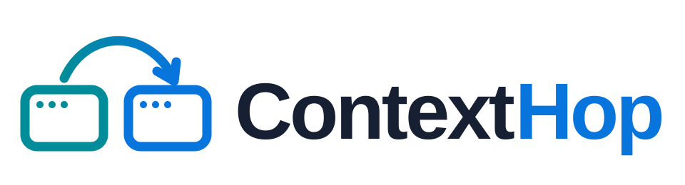

<picture>
  <source media="(prefers-color-scheme: dark)" srcset="docs/brand/workspace-hop-dark.svg">
  <source media="(prefers-color-scheme: light)" srcset="docs/brand/workspace-hop-light.svg">
  
</picture>

> [!WARNING]
> **Under active development.** ContextHop is still being heavily developed. Major changes, including breaking changes to commands, configuration, and behaviour, may arrive with little notice.

**Choose your context. Apply across terminals or keep a shell independent.**

ContextHop (`chop`) combines Google Cloud identities, projects, Kubernetes
clusters, and Docker contexts into a single selection. Apply it across integrated
terminals, pin it to one shell, or run a command in an isolated session. Save
combinations as named workspaces to use them again.

## Why ContextHop `chop`?

ContextHop is for you if you:

- **Work across organisations, accounts, or projects.** Switch identities,
  projects, and their Kubernetes clusters together using a saved workspace.
- **Lose track of which terminal is using which account.** See the active
  context and the one you’re about to apply before switching.
- **Use several terminals for the same work.** Apply a selection to all terminals
  following the shared config, ready for gcloud, kubectl, or k9s.
- **Work on several systems at once.** Pin a selection to this shell or open an
  isolated subshell so later shared changes leave it unchanged.
- **Keep juggling browser windows to sign in.** Authentication can open a
  matching Chrome profile, reducing manual account switching and copying login links.
- **Spend time finding the right cloud console page.** Select a project or GKE
  cluster and press Ctrl+O to open its management page using the identity’s
  configured or matching browser profile.
- **Need Terraform or another application to use a particular identity.** Enable
  Application Default Credentials (ADC) for your selection, with or without a
  saved workspace.
- **Want to keep your existing setup.** Import local contexts without switching
  their active state, and work with session copies of your kubeconfigs. Your
  originals remain available when you stop using ContextHop.

See [credentials and isolation](docs/credentials.md) for browser matching,
shared credential paths, and removing the optional shell hook.

## Install

Supported platform: **macOS on Apple Silicon (ARM64), with zsh**.
Install the provider tools you use separately.

```sh
brew install infurio/tap/contexthop
```

[Get started](docs/getting-started.md) · [User guide](docs/usage.md) ·
[All documentation](docs/README.md)

## Select a context

Run `chop` to open Workspaces. Filter a saved name, or use the entity tabs to
build a context. The launch shortcuts are:

- **Enter — Update shared:** replace the shared config with Selected and follow it here.
- **Shift+Enter — Pin:** apply only to this shell and pin its selection.
- **Option+Enter — Subshell:** start an isolated subshell (Alt+Enter).
- **Ctrl+G — Join shared:** rejoin without changing the shared config.

Following terminals update at their next prompt or before their next command.
Pinned shells and subshells stay unchanged. **Space** fixes a selection while you browse.
The **Active / Selected** columns show what is running and what will launch.
Press **/** to filter, **Esc** to keep the results and browse, then **Space** to
stage a row. Press **/** to resume editing or **Esc** again to clear the filter.
**Left/Right** and **Tab** switch tabs while preserving their filters.


Save a selected combination of cloud, Kubernetes, and Docker with **Ctrl+W**,
including its ADC setting. Saving leaves Active unchanged; filter the saved name
to select the whole combination again.


See the [user guide](docs/usage.md) for shortcuts, ADC, and Zsh integration setup.

## Discover resources

Import existing local contexts or discover Google Cloud projects and GKE
clusters. Keep your own names and tags, then save useful combinations as workspaces.


## Keep terminals independent

ContextHop uses isolated cloud credential directories and session-specific
kubeconfig copies. Importing local contexts reads your existing setup without
switching its active contexts. Exit a subshell to return to its parent.


Use **Ctrl+R** to copy another live session into an independent shell.
[Watch session reuse](docs/usage.md#cli-launches-and-session-reuse).

Isolation depends on keeping credential paths separate; explicitly pointing
ContextHop at existing credential files shares that state.
Read [credentials and isolation](docs/credentials.md) for details.

The demos use fictional data and local provider stubs.
[Recordings](docs/demos/README.md) · [Development and deployment](DEVELOPMENT.md) ·
[Architecture](docs/architecture.md)

## Feedback and contributions

[Report a bug or suggest a feature](https://github.com/infurio/contexthop/issues/new/choose),
read the [contribution guide](CONTRIBUTING.md), or
[report a vulnerability privately](SECURITY.md).
Use fictional resource names and remove credentials and private details from reports.

## Licence

ContextHop is available under the [MIT licence](LICENSE).
See [third-party notices](THIRD_PARTY_NOTICES) for dependency licences.
